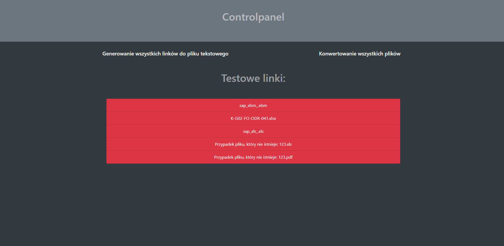

# 2PDF
2PDF jest narzędziem umożliwiającym konwersję plików excela do PDF. Narzędzie to zostało stworzone przy użyciu Pythona, JS i HTML.
PDF może być konwertowany dla danego pliku (poprzez podanie parametru w linku) lub dla wszystkich plików w folderze <b>Converter</b>.
W przypadku konwersji dla danego pliku, PDF zostaje wyświetlany w przeglądarce po zakończeniu procesu konwersji. Narzędzie jest
w stanie wygenerować wszystkie linki dla każdego pliku PDF w folderze <b>Converter</b> i zapisać je w pliku <i>links.txt</i>.
Dodatkowo osoba zarządzająca tym narzędziem jest w stanie kontrolować to narzędzie używając controlpanelu znajdującego się w <b>index.html</b>

# Działanie programu w XAMPP
Aby 2PDF mógł działać w XAMPP trzeba folder o nazwie 2PDF umieścić w folderze htdocs. Następnie trzeba zmienić w ustawieniach Appache httpd.conf, zmieniając
DocumentRoot i Directory na lokalizację folderu 2PDF. Dodatkowo należy dodać na końcu pliku poniższe linijki kodu:
``` 
AddHandler cgi-script .py
ScriptInterpreterSource Registry-Strict
```
Oprócz tego należy wprowadzić w każdej linijce pliku z rozszerzeniem .py ścieżkę Pythona
```
Przykład scieżki:
#!C:\Users\kenno\AppData\Local\Programs\Python\Python38\python.exe
```
Po wpisaniu <b>localhost</b> w przeglądarce narzędzie będzie gotowe do pracy.

# Wymagania
- Python 3.8 lub wyższy
- Biblioteka pywin32
- Microsoft Excel

# Galieria

